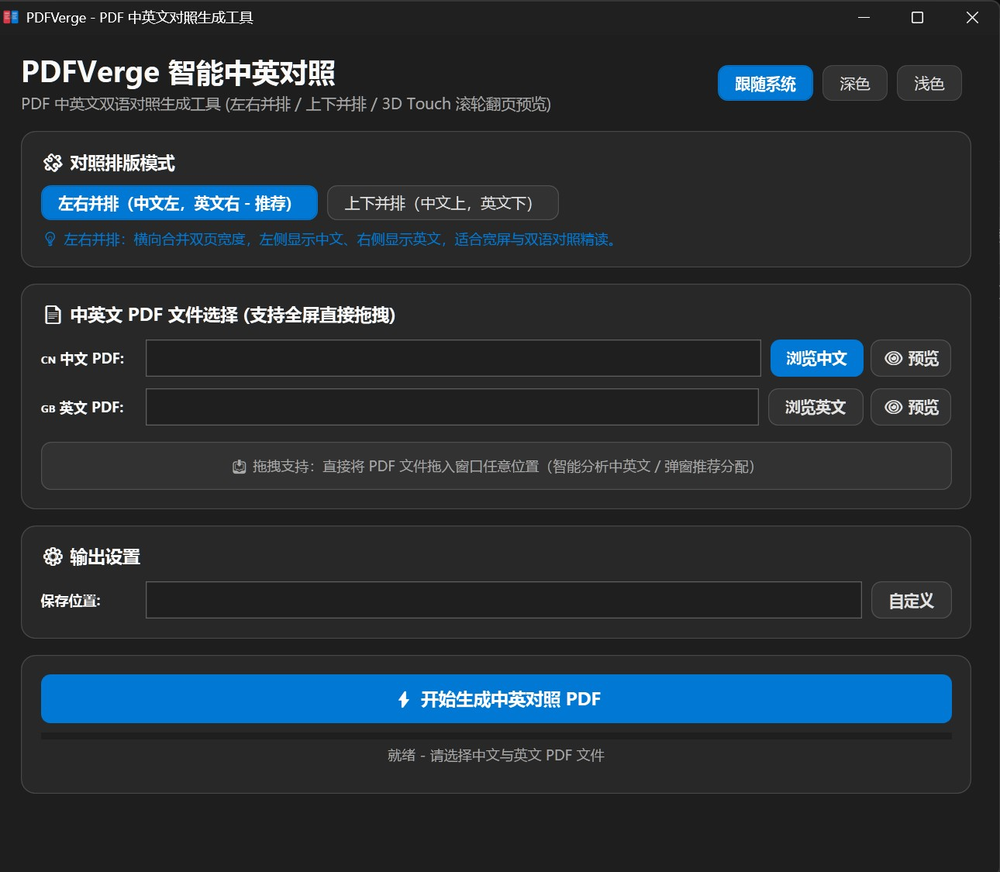
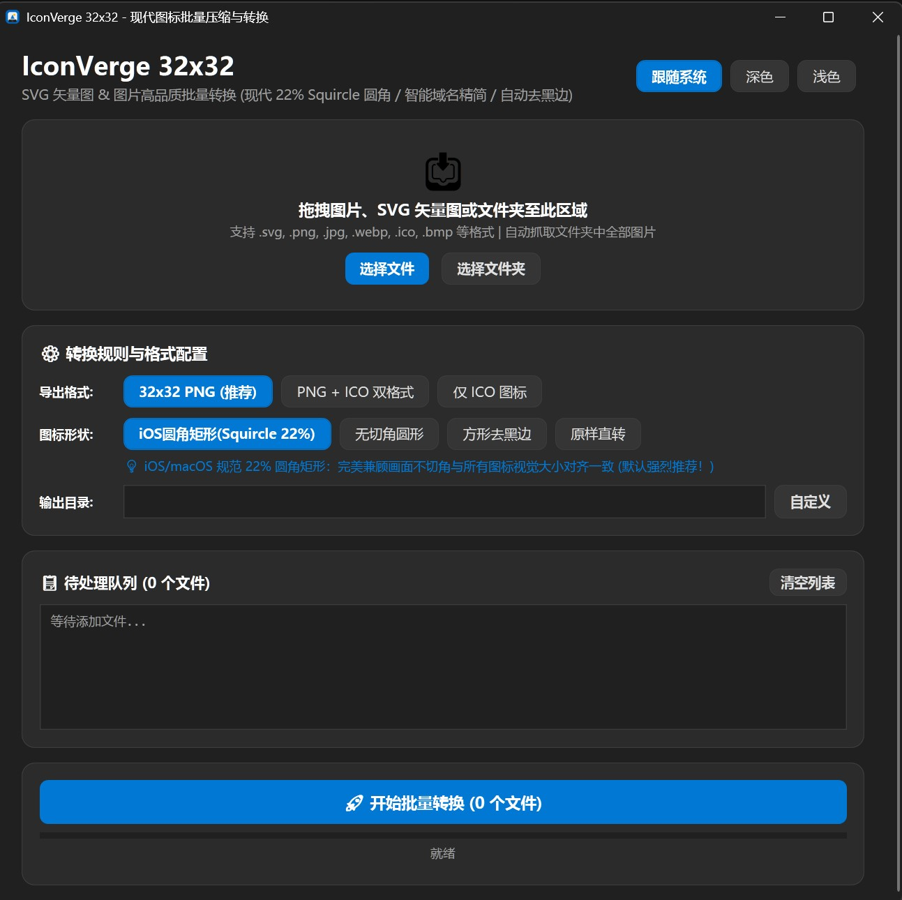

<div align="center">

# FluentToolbox

**专为 Windows 11 设计的轻量、原生桌面小工具集**

[](LICENSE)
[](https://dotnet.microsoft.com/)
[](https://www.microsoft.com/windows)
[](https://learn.microsoft.com/windows/apps/design/)

零冗余依赖 · 原生 DWM 深浅色适配 · 60~240Hz 高刷物理阻尼平滑滚动 · 亚克力通透质感

</div>

---

## 🛠️ 工具列表

### 1. 📄 PDFDual — PDF 双语中英对照智能排版

将中文版与英文版 PDF 智能并排或上下拼接为双语对照文档，方便宽屏精读与文献翻译。

- **并排排版模式**：支持「左右并排（中文左、英文右）」与「上下并排（中文上、英文下）」两种视图。
- **智能语言嗅探**：拖入文件瞬间静默识别中英文编码与内置字体，弹窗直接给出最佳导入建议，一键采纳。
- **3D Touch 压感即时预览**：按住预览按钮即刻弹性放大展开第 1 页高清矢量图，松手自动回弹收起。
- **滚轮多页翻页**：按住预览期间直接滚动鼠标滚轮，可在多页间丝滑翻页查看。
- **独立动作按钮**：生成完毕后提供「打开 PDF 文件」与「打开所在文件夹」快捷操作。

<div align="center">
  
</div>

---

### 2. 🎨 IconCraft — 现代 32×32 图标批量压缩与圆角转换

高品质批量将各类图片与 SVG 矢量图转换为现代 32×32 网页与应用图标。

- **现代 22% Squircle 圆角**：采用 Apple/Fluent 规范连续曲率超采样算法，兼顾画面完整不切角与图标视觉对齐。
- **多种剪裁模式**：支持 22% Squircle 圆角矩形、无切角圆形、方形智能去黑边以及原样直转。
- **格式双模导出**：支持标准 32×32 PNG、多尺寸复合 Windows ICO（16~256px）或双格式同步输出。
- **智能域名与路径清洗**：自动剔除 URL 前缀（`www.`、`https:` 等），生成规整文件名。
- **海量队列流畅渲染**：百行虚拟化渲染与 UI 调度节流，处理数千张图片依然丝滑不卡顿。

<div align="center">
  
</div>

---

## 💎 设计与原生特性

- **Win11 DWM 沉浸式主题**：深色（#1E1E1E 碳黑）与浅色（#F6F6F8 冷灰）自适应，无缝同步 Windows 标题栏颜色与圆角。
- **高刷帧同步平滑滚动**：通过 `CompositionTarget.Rendering` 实现帧同步物理阻尼指数衰减，彻底告别滚动卡顿与掉帧。
- **Store 同款交互动效**：按钮微缩放触控反馈、亚克力全屏防闪烁拖拽遮罩、Thumb 拖动锁定胶囊样式。
- **Windows Taskbar 任务栏联动**：合成与转换过程中在系统任务栏图标实时同步绿色进度条。

---

## 🚀 编译与运行

本项目基于 **.NET 10 (WPF)** 开发，依赖 Windows 10/11 原生 DirectComposition 与 WinRT PDF 渲染管线，无需安装额外运行时。

### 源码编译

```powershell
# 编译 PDFDual
dotnet publish src/PDFDual/PDFDual.csproj -c Release -r win-x64 --self-contained false -p:PublishReadyToRun=true -o bin/PDFDual

# 编译 IconCraft
dotnet publish src/IconCraft/IconCraft.csproj -c Release -r win-x64 --self-contained false -p:PublishReadyToRun=true -o bin/IconCraft
```

编译产物将生成在 `bin/PDFDual/PDFDual.exe` 与 `bin/IconCraft/IconCraft.exe`。

---

## 📄 开源协议

本项目采用 [Apache License 2.0](LICENSE) 开源许可证。

